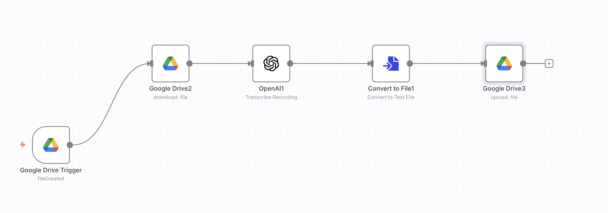

# 🎙️ Transcribe Google Trigger  

**Purpose:**  
Automatically detects new MP3 files uploaded to a Google Drive folder, transcribes them using OpenAI, and saves the text in another Google Drive folder.  

**JSON:** [`workflows/Transcribe_Google_Trigger.json`](../workflows/Transcribe_Google_Trigger.json)  
**Screenshot:**   

---

## ⚙️ Prerequisites
- Google Drive credentials (OAuth2)  
- OpenAI API key  

---

## 🧩 Nodes & Connections
- **Google Drive Trigger** → Watches for new files in a folder  
- **Google Drive (Download)** → Retrieves MP3 file  
- **OpenAI (Whisper)** → Transcribes audio into text  
- **Convert to File** → Creates `.txt` file from transcription  
- **Google Drive (Upload)** → Saves transcription to a target folder  

---

## 📥 Inputs
- MP3 file uploaded into Google Drive (`Audio` folder).  

## 📤 Outputs
- `.txt` transcription saved into a `Transcriptions` folder.  

---

## 🧪 Example
**Input:** `team_meeting.mp3`  
**Output:** `team_meeting.txt` containing transcription.  

---

## 📝 Version / Changelog
- **v1.0 (2025-09-06):** Initial workflow export  
