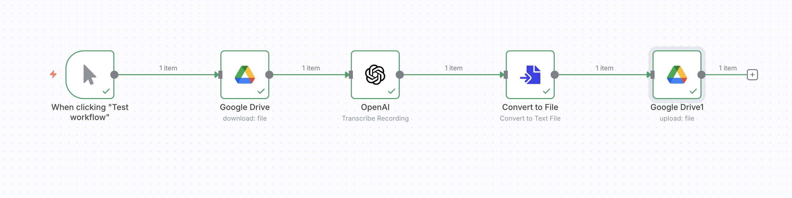

# 📂 Transcribe Output to Google Drive  

**Purpose:**  
Takes transcribed audio text and automatically saves it back into Google Drive in a structured format.  

**JSON:** [`workflows/Transcribe_Output_to_Google_Drive.json`](../workflows/Transcribe_Output_to_Google_Drive.json)  
**Screenshot:**   

---

## ⚙️ Prerequisites
- Google Drive credentials (OAuth2)  
- OpenAI API key  

---

## 🧩 Nodes & Connections
- **Google Drive (Download)** → Fetches audio file  
- **OpenAI (Whisper)** → Converts speech to text  
- **File Node** → Creates `.txt` file  
- **Google Drive (Upload)** → Stores the transcription in Drive  

---

## 📥 Inputs
- MP3 file from Google Drive  

## 📤 Outputs
- A `.txt` file with transcription saved to Drive  

---

## 🧪 Example
**Input:** `interview.mp3`  
**Output:** `interview.txt` stored in Google Drive.  

---

## 📝 Version / Changelog
- **v1.0 (2025-09-06):** Initial workflow export  
