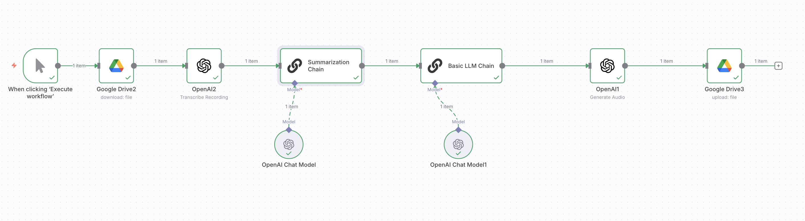

# 🌍 Transcribe, Summarize, Translate & Generate  

**Purpose:**  
A complete pipeline that transcribes audio, summarizes the content, translates it into another language, and optionally regenerates the output as new audio.  

**JSON:** [`workflows/Transcribe_Summarize_Translate_Generate.json`](../workflows/Transcribe_Summarize_Translate_Generate.json)  
**Screenshot:**   

---

## ⚙️ Prerequisites
- Google Drive credentials (OAuth2)  
- OpenAI API key  

---

## 🧩 Nodes & Connections
- **Google Drive (Download)** → Fetches MP3 audio  
- **OpenAI (Whisper)** → Transcribes audio to text  
- **OpenAI (LLM)** → Summarizes content  
- **OpenAI (LLM)** → Translates into target language  
- **Text-to-Speech** → Regenerates new audio file (optional)  
- **Google Drive (Upload)** → Saves transcription, summary, and translations  

---

## 📥 Inputs
- MP3 file uploaded into Google Drive  

## 📤 Outputs
- Transcription (Text)  
- Summarized version (Text)  
- Translated version (Text, e.g., English → Spanish)  
- Optional regenerated audio file  

---

## 🧪 Example
**Input:** `lecture.mp3`  
**Output:**  
- `lecture_transcription.txt`  
- `lecture_summary.txt`  
- `lecture_translation_es.txt`  
- `lecture_summary_audio.mp3` (optional)  

---

## 📝 Version / Changelog
- **v1.0 (2025-09-06):** Initial workflow export  
