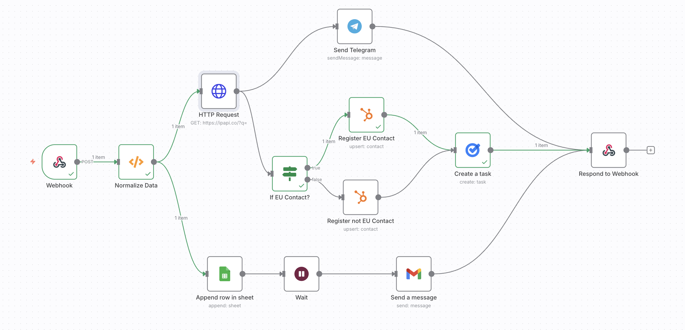

# 📬 Contact Form Automation  

**Purpose:**  
This workflow automates the handling of **form submissions** from a website. When a user submits a form, the workflow:  
- Receives the data via Webhook  
- Fetches IP-based location info from `ipapi.co`  
- Classifies contacts by **EU vs Non-EU region**  
- Logs the submission in Google Sheets  
- Sends a **welcome email** to the user  
- Sends a **Telegram notification** to admin  
- Registers the contact in **HubSpot CRM**  
- Creates a follow-up task in **Google Tasks**  
- Returns a confirmation response to the frontend  

**JSON:** [`workflows/contact-form-automation.json`](../workflows/contact-form-automation.json)  
**Screenshot:**   

---

## ⚙️ Prerequisites
Before running this workflow, set up the following:  
- 🌐 **Webhook** URL connected to your form  
- 📊 **Google Sheets** credentials (for storing submissions)  
- 📧 **Gmail** credentials (for sending welcome emails)  
- 🤖 **Telegram Bot** API key (for admin alerts)  
- 📈 **HubSpot CRM** API token  
- ✅ **Google Tasks** credentials  

---

## 🧩 Nodes & Connections
1. **Webhook** → Captures form submission (name, phone, email, message, IP).  
2. **Normalize Data** → Prepares the payload.  
3. **HTTP Request (ipapi)** → Fetches geolocation data based on IP.  
4. **If Node (EU Contact?)** → Branches workflow depending on EU vs Non-EU region.  
5. **Google Sheets (Append Row)** → Stores form submission in a spreadsheet.  
6. **Wait** → Adds a delay before sending confirmation.  
7. **Gmail (Send Message)** → Sends a welcome email to the user.  
8. **Telegram (Send Message)** → Sends admin notification about new lead.  
9. **HubSpot (EU / Non-EU Contact)** → Creates contact in HubSpot with region flag.  
10. **Google Tasks (Create Task)** → Creates a follow-up task for the sales team.  
11. **Respond to Webhook** → Returns confirmation JSON to the frontend.  

---

## 📥 Inputs
- User-submitted form data:  
  - Name  
  - Email  
  - Phone  
  - Message  

---

## 📤 Outputs
- Submission logged in **Google Sheets**  
- Contact saved in **HubSpot** with region tag  
- **Telegram alert** sent to admin  
- **Welcome email** sent to user  
- **Follow-up task** created in Google Tasks  
- JSON response returned to the frontend  

---

## 🧪 Example
**User Submission:**  
- Name: Alice Johnson
- Email: alice@example.com
- Phone: +49123456789
- Message: Interested in pricing


**Workflow Actions:**  
- Data logged in Google Sheets (`leads_sheet`)  
- IP checked → Region: EU  
- Contact saved in HubSpot with `europe=true`  
- Telegram alert sent to admin  
- Welcome email sent to Alice  
- Follow-up task created in Google Tasks  
- Webhook responds:  
  ```json
  {
    "status": "success",
    "message": "Form submitted successfully"
  }
