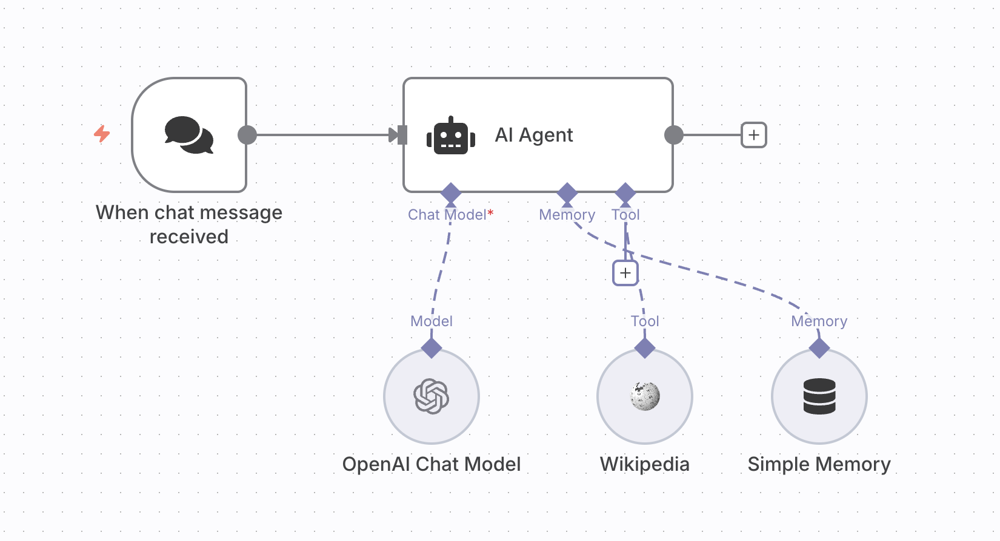

# 🧠 AI Chat with Wikipedia

**Purpose:**  
This workflow enables a conversational AI agent that can answer user queries by retrieving information directly from **Wikipedia**. It combines OpenAI’s GPT model with memory and external search tools to create a smart knowledge assistant.  

**JSON:** [`workflows/AI_Chat_with_Wikipedia.json`](../workflows/chat-with-wikipedia.json)  
**Screenshot:**   

---

## ⚙️ Prerequisites
- **Credentials:**
  - OpenAI API Key (configured in n8n credentials)
- **Environment:** Running n8n (local or cloud)

---

## 🧩 Nodes & Connections
- **When Chat Message Received** → Entry point for user messages.  
- **AI Agent** → Central node that orchestrates memory, model, and tools.  
- **OpenAI Chat Model (gpt-4o-mini)** → Generates natural language responses.  
- **Wikipedia Tool** → Searches and retrieves information from Wikipedia.  
- **Simple Memory** → Maintains short-term conversational context.  

---

## 📥 Inputs
- User chat messages (e.g., “Who founded SpaceX?”)  

---

## 📤 Outputs
- AI-generated responses with factual information pulled from Wikipedia and enhanced with natural language generation.  

---

## 🚀 Setup
1. Import the JSON file into your n8n instance.  
2. Configure your **OpenAI API credentials**.  
3. (Optional) Adjust the memory window size in **Simple Memory**.  
4. Activate the workflow.  

---

## 🧪 Example
**User Input:**  
`Tell me about Nikola Tesla.`  

**AI Response:**  
“Nikola Tesla was a Serbian-American inventor and engineer best known for his work on alternating current (AC) electricity supply systems. He also contributed to the development of radio, wireless communication, and electric motors.” 

---

## 📝 Version / Changelog
- **v1.0 (2025-09-06):** Initial workflow export  
