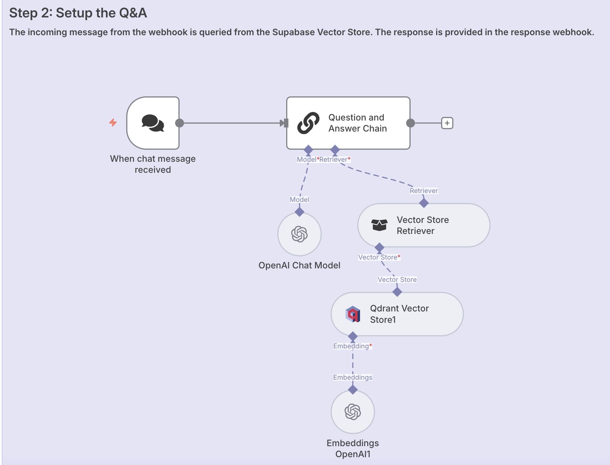

# 💬 Chat with Docs – Query Workflow  

**Purpose:**  
Enables conversational Q&A against documents previously stored in **Qdrant**. Uses OpenAI and retrieval-augmented generation (RAG) to answer user queries.  

**JSON:** [`workflows/chat-with-docs_query.json`](../workflows/chat-with-docs_query.json)  
**Screenshot:**   

---

## ⚙️ Prerequisites
- OpenAI API key  
- Qdrant instance with an indexed collection (`hrpolicy`)  
- The **Upsert Workflow** should be run first to populate Qdrant  

---

## 🧩 Nodes & Connections
- **When Chat Message Received** → Webhook/chat trigger for user query.  
- **Question & Answer Chain** → Connects retriever and language model.  
- **OpenAI Chat Model** → Generates natural language responses.  
- **Vector Store Retriever** → Fetches relevant chunks from Qdrant.  
- **Qdrant Vector Store** → Provides document embeddings for retrieval.  
- **OpenAI Embeddings** → Supports semantic similarity search.  

---

## 📥 Inputs
- User chat question (e.g., “What is the leave policy?”)  

## 📤 Outputs
- AI-generated natural language answer based on HR policy documents  

---

## 🧪 Example
**User Input:**  
`What is the sick leave entitlement for employees?`  

**AI Response:**  
“According to the HR policy, employees are entitled to 12 days of paid sick leave annually. Additional leave requires medical certification.”  

---

## 📝 Version / Changelog
- **v1.0 (2025-09-07):** Initial workflow export  
