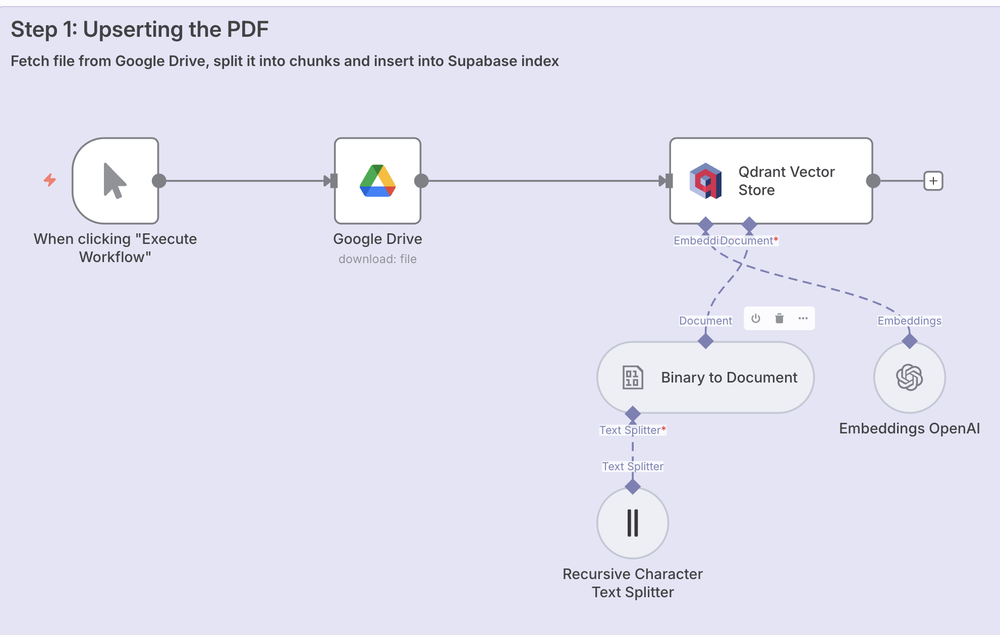

# 📚 Chat with Docs – Upsert Workflow  

**Purpose:**  
Fetches a document (e.g., PDF) from Google Drive, splits it into chunks, generates embeddings with OpenAI, and stores them in a **Qdrant vector database** for later querying.  

**JSON:** [`workflows/chat-with-docs_upsert.json`](../workflows/chat-with-docs_upsert.json)  
**Screenshot:**   

---

## ⚙️ Prerequisites
- Google Drive credentials (OAuth2)  
- OpenAI API key  
- Qdrant instance and credentials  

---

## 🧩 Nodes & Connections
- **Manual Trigger** → Starts the workflow manually.  
- **Google Drive** → Downloads a file (e.g., PDF) from Drive.  
- **Recursive Character Text Splitter** → Splits the file into smaller chunks.  
- **Binary to Document** → Converts binary file chunks into text documents.  
- **OpenAI Embeddings** → Generates embeddings from text chunks.  
- **Qdrant Vector Store** → Stores embeddings in a Qdrant collection (`hrpolicy`).  

---

## 📥 Inputs
- PDF or text file from Google Drive  

## 📤 Outputs
- Indexed embeddings stored in Qdrant for retrieval and Q&A  

---

## 🧪 Example
**Input:** `HR_policy.pdf`  
**Output:** Chunks of the HR policy embedded and stored in Qdrant collection `hrpolicy`.  

---

## 📝 Version / Changelog
- **v1.0 (2025-09-07):** Initial workflow export  
