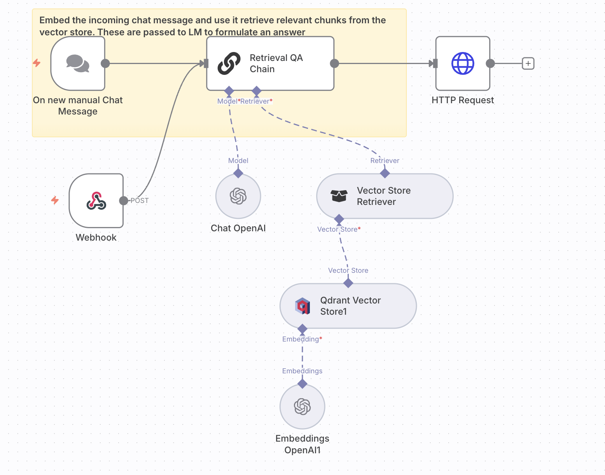

# 💬 Slack Bot – Query Workflow  

**Purpose:**  
Enables a Slack bot that answers user questions by retrieving relevant chunks from **Qdrant** and generating natural language responses using OpenAI.  

**JSON:** [`workflows/Slack_Bot.json`](../workflows/slack-bot-query.json)  
**Screenshot:**   

---

## ⚙️ Prerequisites
- Slack App with Webhook integration  
- OpenAI API key  
- Qdrant database with embedded documents (via Upsert Workflow)  

---

## 🧩 Nodes & Connections
- **Slack Webhook** → Receives user chat messages  
- **Embeddings OpenAI** → Converts query into embedding  
- **Qdrant Vector Store (Retrieve)** → Finds top-k relevant chunks  
- **Vector Store Retriever** → Passes chunks to LLM  
- **Retrieval QA Chain** → Combines retrieved data + LLM response  
- **OpenAI Chat Model** → Generates conversational answer  
- **HTTP Request** → Sends response back to Slack via `response_url`  

---

## 📥 Inputs
- User question in Slack channel  

## 📤 Outputs
- AI-generated response posted back to Slack  

---

## 🧪 Example
**User Input (Slack):**  
`What does the AbbVie equity analysis say about revenue growth?`  

**AI Response (Slack):**  
“The AbbVie equity analysis notes consistent revenue growth driven by strong oncology and immunology portfolios, with projected YoY growth above industry average.”  

---

## 📝 Version / Changelog
- **v1.0 (2025-09-08):** Initial workflow export  
