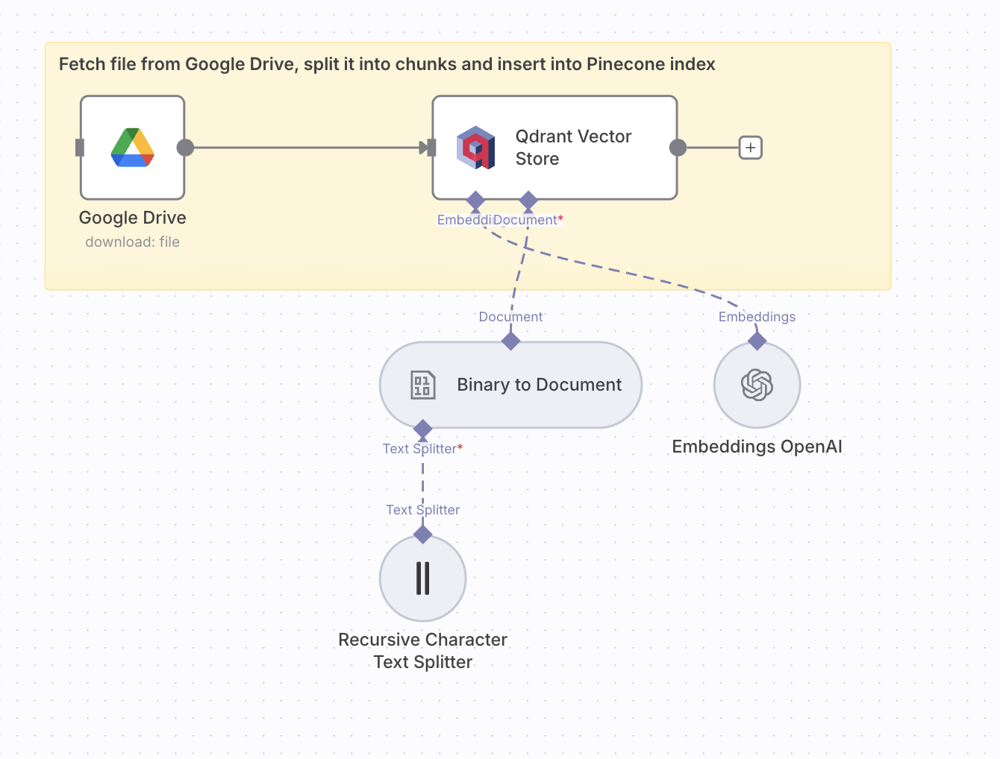

# 🤖 Slack Bot – Upsert Workflow  

**Purpose:**  
Fetches documents (e.g., PDF) from Google Drive, processes them into embeddings with OpenAI, and stores them in **Qdrant vector database** for retrieval.  

**JSON:** [`workflows/Slack_Bot.json`](../workflows/slack-bot-upsert.json)  
**Screenshot:**   

---

## ⚙️ Prerequisites
- Google Drive credentials  
- OpenAI API key  
- Qdrant database instance and credentials  

---

## 🧩 Nodes & Connections
- **Google Drive** → Downloads PDF file  
- **Binary to Document** → Converts PDF into text  
- **Recursive Character Text Splitter** → Splits text into chunks (size: 3000, overlap: 200)  
- **OpenAI Embeddings** → Generates vector embeddings  
- **Qdrant Vector Store (Insert)** → Stores embeddings in collection (`nvda`)  

---

## 📥 Inputs
- PDF file in Google Drive  

## 📤 Outputs
- Embeddings inserted into Qdrant for later retrieval  

---

## 🧪 Example
**Input:** `abbv-morningstar-equity-analysis.pdf`  
**Output:** Embedded chunks stored in Qdrant collection `nvda`.  

---

## 📝 Version / Changelog
- **v1.0 (2025-09-08):** Initial workflow export  
